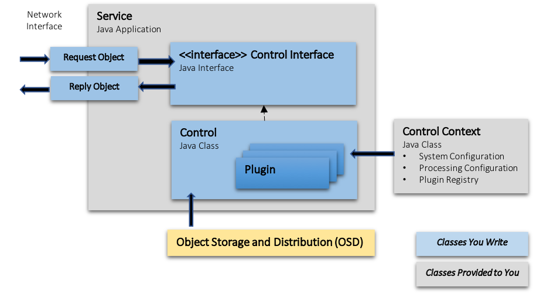

# **GMS Frameworks**

## Frameworks Vision

*Improve software quality, consistency and development productivity
for the GMS project and future extension efforts through the use of
project-standard software frameworks.*

## Design Goals
* Encapsulate the implementation details & complexity of common System functions (IPC, data persistence, configuration, etc.)
* Simplify application development by reducing the amount of boilerplate code needed
* Enforce project-standard software patterns and practices through shared software rather than guidance wherever possible
* Provide comprehensive design user documentation

---
---

## Available Frameworks:
* [**Object Transmission and Storage**](#object-transmission-and-storage)
* [**Control Framework**](#control-framework)
* [**Control Context**](#control-context)
* [**System Configuration**](#system-configuration)
* [**Processing Configuration**](#processing-configuration)
* [**Plugin Registry**](#plugin-registry)
* [**Logging Standards**](#logging-standards)

---
---

## Object Transmission and Storage

The term **Domain Object** describes a Java class which represents
some specific entity in a larger domain model. For example, the GMS
domain would have domain objects representing things such as a *Signal
Detection* or an *Event Hypothesis*.

**The GMS preference is to have simple domain objects that act as
informational containers with no business logic.**  

* Domain objects may be annotated to be used directly as **Data
  Transfer Objects** (**DTOs**). These objects can be easily serialized
  and deserialized for communication between processes.

* Our goal is to support annoating domain objects may for use directly
  as **Data Access Objects** (**DAOs**). If the domain object
  internals do not cleanly map to persistent DAO primitive types, a
  parallel DAO would be needed. For these cases, an object mapping is
  defined to automatically handle the conversion between Domain Object
  and DAO.

[**Details on annotating Java objects for data transmission and
persistence can be found here.**](doc/object-transmission-and-storage.md)

## Control Framework

The **Control Framework** provides a simple and consistent pattern for
integrating *processing operations* implemented in Java into the GMS
system. A processing operation would be invoked in one of two ways:

* **Service Application** <br>
  Each service in the system runs as a Java application in a separate
  Docker container. By convention, a processing operaton is invoked
  via an HTTP POST request with a **Request Object** and the results
  of the processing operation are synchronously returned via a **Reply
  Object**.

* **NiFi Component** <br>
  Processing operations may alternatively be invoked as part of a
  **NiFi** data flow.

The interface between the service interface and the underlying
processing operations is implemented via a **Control Component**.

> Note: The implementation of a **Service Application** and a **NiFi
> Component** are nearly idential. Both would share the same **Control
> Component** implementation.

A **Control Component** manages the execution of one or more related
processing operations. Control components may implement these
processing operations directly or may delegate to a set of underlying
**Plugins**.

For each processing operation, the **Control Component** is given an
input request object. It may at that point collect any other other
required data from the **Object Storage and Distribution** subsystem
before invoking the underlying processing operation. The reply object
is then returned to the requestor.

Multiple implementations of a given processsing operation might be
written beneath a single **Plugin** interface, with the appropriate
operation for a given set of conditions invoked depending on
**Processing Configuration** settings.

Much of the code necessary to implement a service is *automatically
generated* based on an annotated **Control Interface** and an
annotated **Request Object** and **Reply Object**.

The component pieces needed to implement a **Service Application**
with a **Control Component** are illustrated below:


> Note: The component pieces needed to implement a **NiFi Component**
> with a **Control Component** would be similar. However this pattern
> has not yet been prototyped and is not pictured here.

### Implementing a Control Component

For a new **Control Component** a developer would implement the
following objects:

1. **Request and Reply Objects**<br>
   Objects that represent the contents of a request and a reply would
   be implemented and annotated [as described
   here](doc/object-transmission-and-storage.md).

2. **Control Interface**<br>
   A new **Control Interface** class would be created for the new control:
   ```java
   import gms.shared.frameworks.annotations.Control;
   import io.swagger.v3.oas.annotations.Operation;
   import io.swagger.v3.oas.annotations.parameters.RequestBody;
   import javax.ws.rs.POST;
   import javax.ws.rs.Path

   @Control("my-operation")
   @Path("/my-operation/service-endpoint")
   public interface MyOperationControlInterface {

     /**
      * Invocation request for My Operation.
      * Accepts a body representing the expected input to the invocation.
      *
      * @return {@link MyReplyObject} object created from execution.
      */
      @Path("/invoke")
      @POST
      @Operation(description = "Performs QC masking on the segments requested")
      MyReplyObject executeMyOperation(
          @RequestBody(description = "The request object details", required = true)
          MyRequestObject request);
   }
   ```
   The following annotations should be specified for the class
   * [`@Control`](frameworks-control-interface-base/src/main/java/gms/shared/frameworks/annotations/Control.java) - Class-level annotation with the **name** of the control. This name is used for looking up configuration values for this component.
   * [`@Path`](https://jax-rs.github.io/apidocs/2.1/javax/ws/rs/Path.html) - Class-level annotation specifing the 'base URL' of the component when run as a service. It is acceptable (and even common) to use the empty string (e.g. `@Path("")`).
   
   The following annotations should be specified for each processing operation in this component:
   * [`@Path`](https://jax-rs.github.io/apidocs/2.1/javax/ws/rs/Path.html) - Method-level annotation specifing a path relative to the 'base URL' to invoke this operation when run as a service.
   * [`@POST`](https://jax-rs.github.io/apidocs/2.1/javax/ws/rs/POST.html) - Method-level annotation required for automatic documentation generation.  Note that all control service endpoints use the `POST` verb regardless of this annotation.
   * [`@Operation`](http://docs.swagger.io/swagger-core/v2.0.0-RC3/apidocs/io/swagger/v3/oas/annotations/Operation.html) - Method-level annotation providing a **description** of this interface for automatically generated documentation.
   * [`@RequestBody`](http://docs.swagger.io/swagger-core/v2.0.0-RC3/apidocs/io/swagger/v3/oas/annotations/parameters/RequestBody.html) - Parameter-level annotation providing a **description** of this request object to provide when invoking the operation. This is used for generating documentation.

3. **Control Component Implentation**<br>
   An implementation of the **Control Interface** written above would
   be created to implement the interface processing operations.
   ```java
   public class MyOperationControl implements MyOperationControlInterface {

      /**
       * Create MyOperationControl from a ControlContext.
       * @param context the control context, not null
       * @return a MyOperation control instance
       */
      public static MyOperationControl create(ControlContext context) {
         ....
      }

      @Override
      public MyReplyObject executeMyOperation(MyRequestObject request) {
         ....
      }
   }
   ```
   The following methods must be written in the **Control Interface** implementation:
   * A `public static` **create** method that takes a **ControlContext** must be written. 
   * The operations specified in the interface must be implemented here. 

A [**Control Context**](control-context) provided to the **Control
Component**, relays the **System Configuration**, **Processing
Configuration**, and **Plugin Registry** to be used for the specific
processing operation. A **Control Context** based on the name of the
**Control Component** is created and provided to you automatically
when the **create** method is invoked.

The **Control Component** may use the [**Plugin Registry**](plugin-registry) to look up an
implementation of a processing operation to invoke.

This **Control Component** then could be easily be used to create a
Service application or in a NiFi component as described below.

### Implementing a Service Application

The code for the **Service Application** is minimal. In the **main**
application method, a **Control Factory** is used to instantiate and
run a given **Control Component**.  `MyServiceApplication.java` may live in it's own project/JAR for separation purposes.

```java
public class MyServiceApplication {

  private MyServiceApplication() {
  }

  public static void main(String[] args) {
    ControlFactory.runService(MyOperationControl.class);
  }
}
```

### Implementing a NiFi Component

**This feature is still under active development.**

## Control Context

A **Control Context** contains:
* [**System Configuration**](system-configuration)
* [**Processing Configuration**](processing-configuration)
* [**Plugin Registry**](plugin-registry)

These items can be retrieved from the **Control Context** as-needed in the
**create** method of the **Control Component**:

```java
public static MyOperationControl create(ControlContext context) {
   SystemConfig systemConfig = context.getSystemConfig();
   ConfigurationRepository processingConfig = context.getProcessingConfigurationRepository();
   PluginRegistry registry = context.getPluginRegistry();
}
```

## System Configuration

**System Configuration** describes parameters generally needed in software
systems, such as hostnames, ports, database connection parameters,
communication timeouts, etc. This type of configuration is retrieved
via simple *key/value* association

Processing-specific configuration is handled separately by the
[**Processing Configuration**](processing-configuration) framework,
which offers richer semantics for representing more complicated
configuration parameters.

* **System Configuration** is bound to the name of a [**Control
  Component**](control-component) and generally accessed via the
  component's [**Control Context**](control-context).
* Values may be retrieved via *key* name.  Note that *key/value* pairs
  may be scoped to the *control name*, with *key/values* specific to a
  *control name* overriding generic *key/value* definitions.
* A `MissingResourceException` will be thrown a requested key is not
  available. Your code should consider it an error if a required
  system configuration value is not present.

### Key Name Scoping 

Looking up a *key* will first look for the name of the *key* prefixed
with the *control name*. If that *key* is not found, it will fall back
to the generic *key* without the prefix.  One way to think of this
is that a general *key/value* can be defined for *all* components in the
system and then overridden for *specific* components.

Consider the following example *key/value* pairs:
```ini
port = 8080
detection.host = detection
detection.port = 80
correlation.host = correlation
```
For this example:
* The value of *"port"* resolved for the *detection* control would be *80*. 
  * Since a control-specific key `detection.port` was defined, that value overrides
    the value for `port`.
* The value of *"port"* resolved for the *correlation* control would be *8080*.
  * Since `correlation.port` was not defined, the value for `port` is returned.
* The *detection* control would look up its own host by requesting the
  value for the key `host`, but it can also look up the host for
  *correlation* by requesting the value for the fully qualified key
  `correlation.host`.

### System Configuration Coding Example

A `SystemConfig` object can be retreived from the **Control Context**
and used to lookup values based on key names.  A number of default key
names are defined in `SystemConfig`. Values are stored as character
strings, but may be converted into a variety of types (int, long,
double, boolean, Duration, Path, ...) on retrieval.

```java
SystemConfig systemConfig = context.getSystemConfig();
String host = systemConfig.getValue(SystemConfig.HOST);
```

> Note: If a configuration value is *not* found for the specified
> *key*, a `MissingPropertiesException` will be thrown. This should be
> considered a fatal exception. The correct fix for this case would be
> to add the missing value to system configuration..

### Managing System Configuration

System Configuration key values are version controlled in the
[**gms-system-configuration.properties**](../../../../../config/system/gms-system-configuration.properties)
file. The latest contents of this file in are loaded into an **etcd**
container on a system build and will be available on the next restart
of the system.

Note that the etcd configuration is not accessible *outside* a running
docker stack. For development and testing on a local machine, you can
run a local instance of the **etcd** container.

Alternatively, specific system configuration values from **etcd** may
be overwritten at runtime by adding entries to a
**configuration-overrides.properties** file in your home direcotry.  Any
*key/value* pairs defined in that file will be preferred over values
from **etcd**.

[**Additional details on System Configuration can be found
here.**](frameworks-system-config/README.md)

## Processing Configuration

**This section has yet to be written.**

## Plugin Registry

Operation-specific **Plugin** interfaces should extend the base
**Plugin** interface. 

[Google AutoService](https://github.com/google/auto/tree/master/service)
is used to generate (compile-time) the `META-INF/services` file that
makes the plugin classes discoverable at runtime.

```java
import com.google.auto.service.AutoService;

@AutoService(Plugin.class)
public interface MyPluginInterface extends Plugin {
   ....

   public String getName();
}
```

* Each **Plugin** must implement a `getName()` method that returns a
  string identifying the plugin.

* Additional methods specific to the processing operation should be
  defined in this interface and implemented by every class that
  implements the interface.

> IMPORTANT NOTE: The argument to `@AutoService` **must** exactly be
> `Plugin.class` (not `MyPluginInterface.class`) or plugins will not
> be discoverable at runtime.

Plugins implemented are automatically discovered and can be looked up
via the **Plugin Registry**.

* **Plugin Registry** lookup by name:
  ```java
  PluginRegistry registry = context.getPluginRegistry();
  MyPluginInterface plugin = registry.get("specific-name", MyPluginInterface.class);
  ```
  
* **Plugin Registry** lookup, given a list of names:
  ```java
  PluginRegistry registry = context.getPluginRegistry();
  Collection<MyPluginInterface> plugins = registry.get(Set.of("one-name", "another-name"), MyPluginInterface.class);
  ```

**Plugin Registry** retrieval operations throw
`IllegalArgumentException` if a plugin is not found by the provided
name or it is not of the required class (i.e. can't be casted to that
type).

## Logging Standards

**TBD - Active development is still being done on this area.**

<!--
## Frameworks Projects

* Control Context
* Control Interface
* Control Component
* Control
* Client Generator
* System Configuration
* HTTP Service Library
* Plugin Registry
* Client Library
* Utilities
* Control Interface Base
-->
